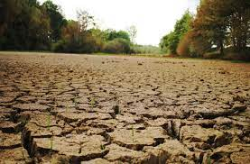

# Codeman contre le crime ! 

## *Our story begins during a particularly hot summer somewhere far far away.*

In the old days and during this season you could enjoyed the laughts of children playing in swimming pools and gardens, meeting around the sports grounds or simply the presence of almost the entire village in the usually peaceful streets of this sweet hamlet of Everwinter .

Usually, the season is hot but nothing abnormal, in spite of the heat, we could refresh ourselves by putting ourselves in the shade of a tree. But this time, everything seemed...different. As if the heat was making the air thin.

People took advantage of the good weather to do all sorts of outdoor activities. But as the good weather never lasts in Belgium, it started to rain, so the people were forced to ...
to go back to a place warm because it start to rain very strong, kids were really sad. their vacations went to the ruin because of the rain but it did not last too much time. The Belgium's president bought a great domo where we would never be bothered by the rain ever again.